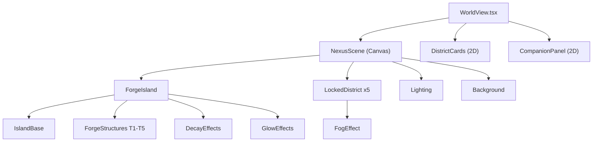

# 3D Nexus World Scene

## Architecture

The 3D scene lives in a new `world/3d/` directory as a self-contained module. It receives `WorldState` and `Player` as props and renders a purely visual representation -- all mutations still flow through the existing handlers.



## Dependencies

Install `three`, `@react-three/fiber`, and `@react-three/drei`:

```bash
npm install three @react-three/fiber @react-three/drei
npm install -D @types/three
```

React Three Fiber gives us declarative JSX for Three.js inside React. Drei provides ready-made helpers (OrbitControls, Float, MeshTransmissionMaterial, etc.).

## File Structure

```
world/3d/
  NexusScene.tsx         -- Main <Canvas> wrapper, camera, lighting, orbit controls
  ForgeIsland.tsx        -- The Forge district: base island + structures + effects
  LockedIsland.tsx       -- Foggy placeholder island for locked/other districts
  IslandBase.tsx         -- Reusable floating island geometry (beveled cylinder + rock formations)
  structures/
    ForgeStructures.tsx  -- 5 tier models: TrainingGrounds, SparringArena, BioLab, ForgeCore, TitanFramework
  effects/
    VitalityEffects.tsx  -- Glow particles (pristine) and desaturation overlay (decay)
    Fog.tsx              -- Volumetric fog planes around locked districts
  materials.ts           -- Shared material factories: neon emissive, decay desaturated, warm glow
  constants.ts           -- Island positions (hex grid layout), color palettes, camera settings
```

## Camera & Controls

- **OrthographicCamera** at 45-degree isometric angle (`position: [10, 10, 10]`, `zoom: ~50`)
- **OrbitControls** with constraints:
  - `enablePan: false`
  - `minPolarAngle / maxPolarAngle`: lock vertical rotation to ~30-60 degrees
  - `minZoom: 30, maxZoom: 100`
  - `enableDamping: true`
- Canvas height: `h-[350px] md:h-[450px]` with rounded corners matching existing UI

## The Forge Island (First District)

### Base Island

A floating hexagonal platform made of:

- Top surface: flat hexagon with beveled edges (warm stone material)
- Underside: jagged rock formation (darker, rougher material)
- Subtle `<Float>` animation (Drei) for gentle hovering feel

### 5 Structures (Procedural Geometry)

Each structure is conditionally rendered based on `StructureState.isBuilt`. They are placed at specific positions on the hexagonal base:

- **T1 - Training Grounds**: Flat circular platform with 4 short pillars at corners. Simple, grounded.
- **T2 - Sparring Arena**: Elevated octagonal ring with railings. Sits above T1.
- **T3 - Bio-Enhancement Lab**: Glowing capsule/cylinder with emissive green-cyan material. Transparent top.
- **T4 - Forge Core**: Central anvil shape with animated "fire" particles above it (orange point sprites). The visual heart of the island.
- **T5 - Titan Framework**: Tall arching exoskeleton frame around the island perimeter. The crown jewel -- large, imposing, geometric.

Each built structure also respects its `condition` (0-100):

- condition > 70: Full color, subtle glow
- condition 40-70: Slightly desaturated, no glow
- condition < 40: Grey-toned, crack lines (thin dark geometry overlaid)

### Vitality Visual Mapping (DistrictState.vitality)

Read from `worldState.districts.find(d => d.id === 'forge').vitality`:

- **80-100 (Pristine)**: Warm orange/red neon accent lines on structures. Floating ember particles. Bloom-like glow on edges. Full saturation.
- **50-79 (Stable)**: Normal lighting, mild warm tones. No particles. Clean look.
- **25-49 (Neglected)**: Desaturated materials (lerp toward grey). Dim point lights. Subtle dark fog wisps rising from cracks.
- **0-24 (Ruined)**: Heavy desaturation. Dark ambient. Structures appear cracked (displaced geometry). No emissive materials. Cold blue-grey tone.

This is achieved by interpolating material properties (color, emissive, emissiveIntensity) based on a normalized vitality value.

## Other Districts (Locked Placeholders)

5 additional islands in a hex-ring layout around The Forge:

- Each is a simple hexagonal platform silhouette
- Wrapped in semi-transparent fog planes (layered transparent quads with noise)
- Color-coded faintly by district color (cyan for Archive, violet for Sanctum, etc.)
- A small `<Text>` label with "???" or the district name if unlocked
- If a district IS unlocked (but not The Forge), show it as a lit but simple platform without detailed structures (future expansion)

## Integration into WorldView

Replace the current header `<div>` (lines 57-91 of [WorldView.tsx](world/components/WorldView.tsx)) with:

```tsx
{
  /* 3D Scene replaces old header */
}
<NexusScene worldState={worldState} player={player} />;

{
  /* Stats bar moves below the scene */
}
<div className="rounded-lg border border-zinc-800/50 bg-zinc-900/60 p-4">
  {/* nexus name, era badge, narrative, stats -- same content, just below scene */}
</div>;
```

The `NexusScene` component accepts `worldState` and `player` and internally derives all visual state.

## Aesthetic: Cute / Soft Cyberpunk

- **Materials**: `MeshStandardMaterial` with warm base colors + neon emissive accents
- **Lighting**:
  - Soft `ambientLight` (warm white, intensity 0.4)
  - `directionalLight` from top-left (warm, intensity 0.8, soft shadows)
  - Per-structure `pointLight` in district accent color (red for Forge) when vitality is high
- **Color palette**:
  - Forge base: warm stone (`#4a3f35`), neon red accent (`#ff4444`)
  - Locked islands: dark slate (`#1a1a2e`), faint neon outlines
  - Background: deep dark gradient (matching `bg-zinc-950`)
- **Post-processing**: None initially (keep performance lean). Can add bloom later.

## Performance Considerations

- All geometry is procedural (no GLTF loading, zero network requests)
- Use `useMemo` for geometry/materials to prevent re-creation on every render
- Particle counts kept low (< 100 sprites for ember effects)
- `frameloop="demand"` on Canvas to only re-render when state changes (not continuous 60fps)
- `dpr={[1, 1.5]}` to cap pixel ratio on retina displays
- On mobile: reduce particle count, simpler shadows

## Interaction (Phase 1)

- **Hover**: Districts highlight on mouse enter (subtle emissive boost)
- **Click**: Scrolls to the corresponding 2D DistrictCard below (smooth scroll)
- **Orbit**: Drag to rotate, scroll to zoom (touch-friendly via Drei's OrbitControls)

## What This Does NOT Include (Future Work)

- Detailed 3D models for the other 5 districts (only The Forge gets full treatment)
- Companion 3D models (companions stay in 2D panels)
- Animated transitions for building/repairing (future: construction animation)
- Post-processing effects (bloom, SSAO)
- Sound design
